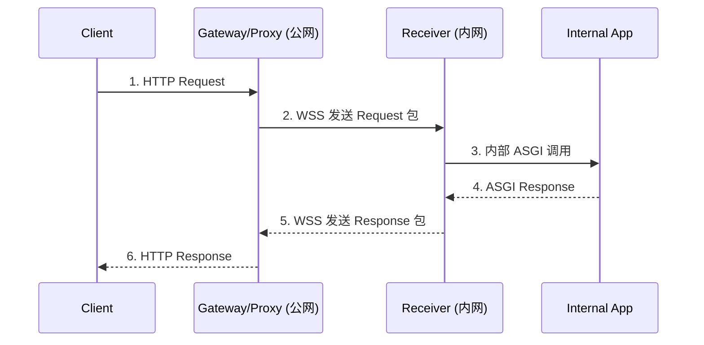

### 一、要解决的核心问题

| 编号 | 痛点描述                                           | 影响                                  |
|------|----------------------------------------------------|---------------------------------------|
| P1   | **局域网 Agent 无公网接口**，难以被外部调用        | 能力无法对外暴露，阻碍生态互联        |
| P2   | **HTTP ↔ 内部服务** 协议不统一，部署受限于框架     | 每换一套框架就要重写代理逻辑          |
| P3   | **NAT / 防火墙穿透复杂**                           | 传统端口映射或 VPN 方案成本高、不稳定 |
| P4   | **安全与多路复用**：明文 WebSocket、不限流、无鉴权 | 容易被劫持或拖垮服务                  |

---

### 二、总体目标

1. **框架无关**：前后端可用任何语言 / 框架，只需遵守统一消息格式。
2. **全量转发**：完整封装 HTTP 方法、路径、Headers、Query、Body 与响应信息。
3. **安全可靠**：WSS（TLS）+ 双向鉴权 + 请求 ID 配对 + 断线重连。
4. **高性能异步**：纯异步 IO、单连接多并发、无磁盘落地。

---

### 三、架构概览

```text
┌────────────┐            WSS (TLS)           ┌──────────────┐
│  Client    │ ─HTTP→ ┌──────────────┐ ─────→ │  Receiver &  │
│  外部调用者  │        │Gateway/Proxy │        │  Internal App│
└────────────┘ ←HTTP─ └──────────────┘ ←───── │  (FastAPI …) │
                 ↑                ↓           └──────────────┘
           Request 包装       Response 包装
```

- **Gateway/Proxy（公网）**
  - 监听所有 HTTP 请求
  - 打包后通过 **WSS** 发送给后端
  - 收到响应包后还原成 HTTP 返回给 Client

- **Receiver（内网）**
  - 维持 WSS 长连接，接收打包请求
  - 还原并**内部调用**本地 Web 框架（示例：`httpx.AsyncClient(app=fastapi_app)`）
  - 将框架返回内容打包为响应，通过 WSS 返还

---

### 四、消息格式

使用二进制详细，详细见相关文档。

[消息格式](./proxy-protocol.md)

---

### 五、关键流程

| 步骤 | 参与方             | 说明                                                      |
|------|--------------------|-----------------------------------------------------------|
| 1    | Gateway            | 收到外部 HTTP 请求 → 解析五元组 → 生成 `request_id`       |
| 2    | Gateway → Receiver | 通过 WSS 发送 **Request 包**                              |
| 3    | Receiver           | 解包 → 用 `httpx.AsyncClient(app=local_app)` 伪造内部请求 |
| 4    | Internal App       | 正常执行业务逻辑，返回 ASGI Response                      |
| 5    | Receiver           | 打包为 **Response 包**（带同一 `request_id`）             |
| 6    | Receiver → Gateway | WSS 发送 Response 包                                      |
| 7    | Gateway            | 还原 HTTP 响应 → 回给外部 Client                          |

#### 时序图（文本示意）

```text
Client            Gateway/Proxy          Receiver             Internal App
                    （公网）             （内网）
 |                     |                    |                      |
 |---1. HTTP Request-->|                    |                      |
 |                     |---2. WSS Request-->|                      |
 |                     |                    |---3. ASGI Call------>|
 |                     |                    |<--4. ASGI Response---|
 |                     |<--5. WSS Response--|                      |
 |<--6. HTTP Response--|                    |                      |
```



### 六、技术选型与实现要点、技术选型与实现要点、技术选型与实现要点

| 组件     | 建议库                                | 备注                              |
|----------|---------------------------------------|-----------------------------------|
| WSS 通道 | `websockets` / `starlette.websockets` | 支持 TLS、Ping/Pong、断线自动重连 |
| 请求封装 | `pydantic` / `dataclasses-json`       | 统一 Schema，易扩展               |
| 内部调用 | `httpx.AsyncClient(app=app)`          | 0 复制 ASGI 路径，高性能          |
| 流控限速 | `asyncio.Semaphore`                   | 防止单连接拖垮后端                |

---

---

#### 📌 结语

通过 **“HTTP ↔ WebSocket ↔ ASGI”** 的桥接模式，你可以：

- **无侵入**地为局域网 Agent 打开安全、可控的公网入口；
- 保留原有框架生态，做到真正的框架无关；
- 统一请求/响应协议后，未来可平滑接入 **多语言 Agent** 与 **多云部署**。

如果需要更深入的代码示例或把它做成可发布的开源库，告诉我即可！
